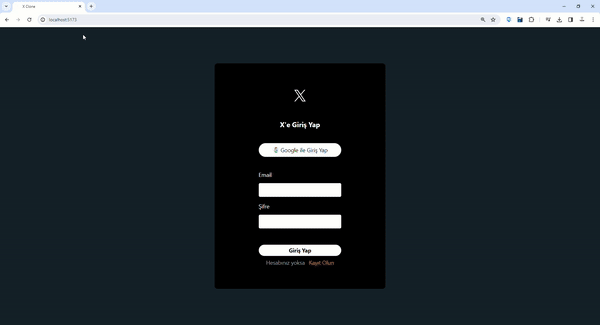

# xTwitterClone

## Screen

## Overview

xTwitterClone is a social media application built with React and Firebase, allowing users to create posts, interact with tweets, and subscribe to premium features.

## Features

- **Authentication**: Utilizes Firebase authentication for user sign-in and sign-up.
- **Real-time Updates**: Fetches and updates tweets in real-time using Firebase Firestore.
- **Tweeting**: Users can compose and post tweets, including text and optional images.
- **Like and Retweet**: Provides functionality for users to like and retweet tweets.
- **Premium Subscription**: Offers a premium subscription feature with additional benefits.
- **Responsive Design**: Responsive and user-friendly design for a seamless experience.

## Technologies Used

- **React**: A JavaScript library for building user interfaces.
- **Firebase**: Cloud-based platform for building serverless applications.
  - Authentication: Handles user authentication.
  - Firestore: Real-time NoSQL database for storing tweets.
  - Storage: Manages storage for user images and tweet pictures.
- **Tailwind CSS**: A utility-first CSS framework for styling components.

## Prerequisites

- Node.js and npm installed locally.
- Firebase project set up with necessary configurations.

## Dependencies

* firebase: 10.6.0
* moment: 2.29.4
* react: 18.2.0
* react-dom: 18.2.0
* react-icons: 4.11.0
* react-router-dom: 6.18.0
* react-toastify: 9.1.3
* uuid: 9.0.1

## Author

Mustafa İlker TEKİR

